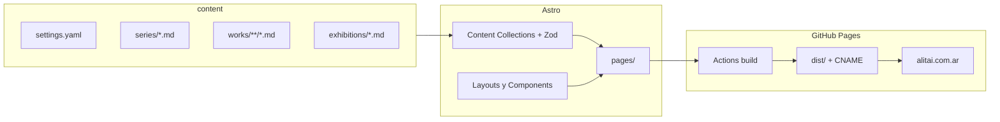

# Plan de refactor — Alitai Portfolio (estructura primero)

Documento operativo basado en la auditoría del portfolio y las decisiones acordadas: mismo hosting (GitHub Pages + `alitai.com.ar`), contenido escalable por archivos, UI diferida.

## 1. Decisiones cerradas

| Decisión | Elección |
|----------|----------|
| Hosting | GitHub Pages + dominio `alitai.com.ar` (sin cambiar proveedor) |
| Quién edita | Técnico hoy; artista mañana con guía + plantillas (sin CMS en v1) |
| Alcance v1 | Arquitectura + capa de contenido; look cercano al actual |
| Stack | Astro (`output: 'static'`) + Content Collections + Tailwind build (no CDN) |
| UI redesign | Fuera de alcance v1 (fase posterior) |

**Por qué Astro:** schema Zod (build falla si falta un campo), una plantilla por tipo de página, Markdown editable, deploy Pages maduro, encaja con “estructura primero, UI después”.

## 2. Objetivo de escalabilidad

Agregar una serie, obra o exhibición = **crear/copiar archivos en carpetas dedicadas + colocar imágenes**, sin tocar layouts ni JS. La guía [`CONTENT.md`](../CONTENT.md) documenta el flujo en español.

## 3. Arquitectura objetivo



### Árbol del repo

```
alitai_portfolio/
├── public/
│   ├── CNAME
│   ├── robots.txt
│   ├── favicon.svg
│   └── images/
├── src/
│   ├── content/
│   │   ├── config.ts
│   │   ├── site/settings.yaml
│   │   ├── series/*.md
│   │   ├── works/<series-slug>/*.md
│   │   └── exhibitions/*.md
│   ├── layouts/
│   ├── components/
│   ├── pages/
│   │   ├── index.astro
│   │   ├── series/[slug].astro
│   │   └── 404.astro
│   └── styles/global.css
├── .github/workflows/deploy.yml
├── docs/
│   ├── CONTENT.md
│   ├── IMAGES.md
│   ├── DOCUMENTACION.md
│   └── refactoring/refactor_plan.md
├── astro.config.mjs
└── package.json
```

## 4. Modelo de contenido

### `site/settings.yaml`

Fuente única de: bio, handle, nombre, rol, contacto, redes, copyright, GTM, verification meta.

### `series/<slug>.md`

Frontmatter:

- `title`, `subtitle` (opcional)
- `dateRange`, `technique`, `worksSummary`
- `cover` (ruta `/images/...`)
- `order` (número; orden en el home)
- `draft` (boolean; default `false`)
- `description` (SEO / OG)

Body = texto de ficha de la serie.

### `works/<series-slug>/<work-slug>.md`

Frontmatter:

- `title`, `technique`, `year`
- `image` (ruta `/images/...`)
- `orientation`: `portrait` | `landscape`
- `order`

Body = descripción de la obra.

La serie se deduce del segmento de carpeta (`works/arquetipos/...` → serie `arquetipos`). El slug del archivo de serie debe coincidir con esa carpeta.

### `exhibitions/<slug>.md`

Frontmatter: `title`, `thumb`, `fullImage`, `order`, `year` (opcional). Body opcional.

### Validación

Schemas Zod en `src/content/config.ts`. Si falta `cover` o `image`, el build falla con mensaje claro (mejor que un sitio roto en producción).

## 5. Flujo editor (artista / técnico)

### Nueva serie

1. Copiar plantillas en `src/content/_templates/`.
2. Crear `src/content/series/<slug>.md` y carpeta `src/content/works/<slug>/`.
3. Colocar imágenes en `public/images/series/<slug>/`.
4. Completar frontmatter y textos.
5. Push → GitHub Actions valida y publica (o `npm run build` local).

La serie aparece en el home ordenada por `order` (si `draft: false`).

### Nueva obra

Un `.md` más en `works/<series-slug>/` + imagen en `public/images/...`.

### Nueva exhibición

Un `.md` en `exhibitions/` + imágenes en `public/images/exhibiciones/`.

## 6. Deploy (mismo hosting)

**Antes:** HTML en raíz, Pages desde branch, `CNAME` en raíz.

**Después:**

- Workflow: `astro build` → artifact `dist/` → GitHub Pages (`deploy-pages`).
- `public/CNAME` = `alitai.com.ar`.
- En GitHub: Settings → Pages → Source = **GitHub Actions**.
- URLs canónicas: `/`, `/series/arquetipos/`, etc.
- Sitemap generado (`@astrojs/sitemap`) con todas las series.
- Redirects desde URLs legacy (`.html` y paths planos) hacia `/series/<slug>/`.

**Trade-off:** build + Node en CI. **Pros:** mismo Pages/dominio, contenido escalable, validación en CI.

### Rollback

Volver Pages a “Deploy from a branch” y restaurar HTML legacy desde git history / `docs/refactoring/legacy/` si se conservó.

## 7. Alcance v1 (estructura)

- Migrar copy de `index.html` y las 5 series a collections.
- Corregir inconsistencias obvias en migración (ADN Estelar: ficha vs cantidad real de obras; `<bold>` → markup válido).
- Lightbox y back-to-top como componentes (a11y básica: Escape, `dialog`, botón).
- Carrusel único de serie; `orientation` reemplaza el hack `h-112`.
- SEO base en layout: title, description, OG, favicon.
- Tailwind local con purge; sin CDN Play.
- Assets huérfanos (`images/series/y/`, `phone.png`) eliminados en limpieza post-migración.

## 8. Fuera de alcance v1

- Nueva identidad tipográfica/color, hero full-bleed, rediseño de galería.
- Pipeline agresivo de imágenes (WebP/AVIF) → **fase 1.5** recomendada.
- CMS visual (Decap/Sveltia/Tina) → **fase futura**; la estructura de archivos ya lo habilita.

## 9. Fases de implementación

1. Scaffold Astro + Tailwind + Actions + CNAME.
2. Content model + migración HTML → MD/YAML + `CONTENT.md` + plantillas.
3. Páginas home / series / 404 + componentes.
4. Higiene SEO/a11y/sitemap/redirects; HTML legacy deja de ser fuente de verdad.
5. Hand-off editor; opcional fase 1.5 imágenes.
6. Fase UI (plan aparte).

## 10. Riesgos y mitigación

| Riesgo | Mitigación |
|--------|------------|
| Cambio Pages → Actions | Documentar rollback; verificar dominio tras el primer deploy |
| Bookmarks `.html` | Redirects en `astro.config.mjs` |
| Artista y Markdown | Plantillas + Zod + `CONTENT.md` |
| Imágenes ~12 MB | Aceptado en v1; priorizar fase 1.5 |

## 11. Criterios de hecho (v1)

- [x] `npm run build` genera el sitio con el contenido actual.
- [x] Se puede agregar una serie solo con archivos de content + imágenes.
- [ ] Deploy Actions a Pages con `alitai.com.ar` operativo (requiere config en GitHub — ver [CUTOVER.md](CUTOVER.md)).
- [x] HTML monolítico ya no es la fuente de verdad (archivado en `docs/refactoring/legacy/`).
- [x] Existe guía clara en español para editores no técnicos (`docs/CONTENT.md`).

## 12. Referencias

- Auditoría: canvas `auditoria-portfolio-alitai.canvas.tsx`
- Dominio: `alitai.com.ar`
- Repo: `heimdall223/alitai_portfolio`
